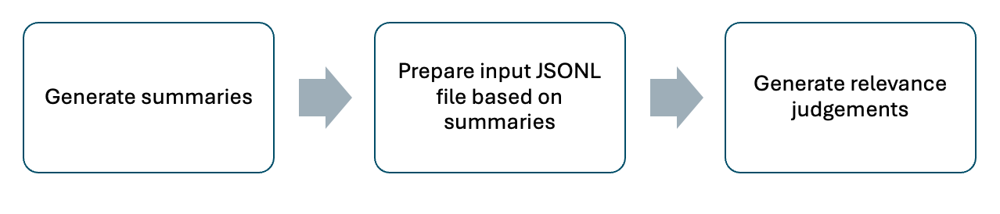

# The Effect of Document Summarization on LLM-Based Relevance Judgments

<p align="center">
  <a href="https://arxiv.org/pdf/2512.05334">
    
  </a>
  
  
</p>

**Paper:** _The Effect of Document Summarization on LLM-Based Relevance Judgments_  
**Authors:** Samaneh Mohtadi, Kevin Roitero, Stefano Mizzaro, Gianluca Demartini  
**arXiv:** 2512.05334 — https://arxiv.org/pdf/2512.05334

---

## Abstract
Relevance judgments are central to the evaluation of Information Retrieval (IR) systems, but obtaining them from human annotators is costly and time-consuming. Large Language Models (LLMs) have recently been proposed as automated assessors, showing promising alignment with human annotations. 
Most prior studies have treated documents as fixed units, feeding their full content directly to LLM assessors. 
We investigate how text summarization affects the reliability of LLM-based judgments and their downstream impact on IR evaluation.
Using state-of-the-art LLMs across multiple TREC collections, we compare judgments made from full documents with those based on LLM-generated summaries of different lengths. We examine their agreement with human labels, their effect on retrieval effectiveness evaluation, and their influence on IR systems' ranking stability.
Our findings show that summary-based judgments achieve comparable stability in systems' ranking to full-document judgments, while introducing systematic shifts in label distributions and biases that vary by model and dataset. These results highlight summarization as both an opportunity for more efficient large-scale IR evaluation and a methodological choice with important implications for the reliability of automatic judgments.


<p align="center">
  
</p>


---

This repository provides:
- **Summarization pipelines** (GPT and Llama) for generating document summaries at different token budgets.
- **LLM-based relevance judgment pipelines** using summaries (and optionally full documents).
- **Analysis notebooks** to reproduce paper results:
  - agreement analysis,
  - system ranking stability analysis,
  - cost analysis,
  - summary quality assessment (G-Eval / BERTScore).

---


## Quickstart

### 1) Create environment

```bash
pip install -U pip
pip install -r requirements.txt
```
### 2) Configure env files

This repo uses .env files stored in code/env_files/. 
Example files:

- code/env_files/gpt.env
- code/env_files/llama_bunya_dl2019.env

Typical variables include:
- OpenAI API key 
- Hugging Face output/cache directories
- dataset paths
## Workflow

<p align="center">
  
</p>


## Usage

All commands below assume you run from:

```bash
cd code
```
## GPT: Generate summaries
Example: generate up to 100 summaries with a 120-token budget.
```bash
python gpt_summarisation.py \
  --env-file "./env_files/gpt.env" \
  --template-file "./templates/summarization_template_gpt_limit120.txt" \
  --output "./summarisation_outputs/gpt_summaries_120tokens.csv" \
  --max-tokens 120 \
  --start-idx 0 \
  --limit 100 \
  --model "gpt-4o"
```

## Generating Relevance Judgements

### A) GPT: Relevance judgments (from inputs JSONL) and export qrels and output log jsonl
```bash
python gpt_summarized_relavance_judgement.py \
  --env-file "./env_files/gpt_dl2019.env" \
  --input "./summarisation_outputs/inputs_from_summaries.jsonl" \
  --template-file "./templates/relevance_judgment_template.txt" \
  --model "gpt-4o" \
  --max-tokens 64 \
  --temperature 0.0 \
  --output "./summarisation_outputs/gpt_relevance_judgements_sample.csv" \
  --jsonl-output "./summarisation_outputs/gpt_relevance_judgements_sample.jsonl" \
  --qrels-output "./summarisation_outputs/gpt_4o_summary_umbrella_zeroshot_qrels.txt" \
  --start-idx 0 \
  --limit 2 \
  --batch-size 1
```

### B) LLAMA: Relevance judgments (from inputs JSONL) and export qrels and output log jsonl

refer to `llama_relevance_judgement.ipynb` for LLAMA relevance judgement generation.


## Summarisation Quality Assessment
  ### A) GPT: Compute BERTScore on summarization outputs (JSONL)
  ```bash
  python gpt_summarisation.py \
  --compute-bertscore \
  --summarisation-results-input "./summarisation_outputs/gpt_summaries_summeval_DM_gpt-4o.jsonl" \
  --output "./summarisation_outputs/gpt_summaries_summeval_DM_gpt-4o_bertscore.csv"
  ```

  ### B) GPT: Compute G-Eval on summarization outputs (JSONL)
  ```bash
  python gpt_summarisation.py \
  --env-file "./env_files/gpt_summeval.env" \
  --compute-geval \
  --summarisation-results-input "./summarisation_outputs/gpt_summaries_summeval_DM_gpt-4o.jsonl" \
  --output "./summarisation_outputs/gpt_summaries_summeval_DM_gpt-4o_geval.csv"
  ```
##  Other
### C) GPT: Estimate summarization cost (dry run)

```bash
python gpt_summarisation.py \
  --env-file "./env_files/gpt.env" \
  --template-file "summarization_template_gpt.txt" \
  --start-idx 0 \
  --limit 5 \
  --estimate
  ```
# Paper Analyses Results
- **Note:** `runs` data are available [here](https://github.com/webis-de/sigir25-llm-inter-annotator-agreement/tree/main/data/runs)

- **Data Preparation:** input_data_preparation_relevance_judgement.ipynb for generating proper input jsonl file for relevance judgement. Prepared version of input jsonl files are available in `data` folder.

- **Agreement analysis:** agreement_analysis_summarisation_relevance_judgement_analysis.ipynb

- **System ranking stability:** system_ranking_analysis_summarisation_relevance_judgement_analysis.ipynb
- **Costing analysis:** costing_analysis_summarisation_relevance_judgement_analysis.ipynb
- **Summary quality:** g-eval-summarisation_quality_assessment.ipynb

Most notebooks expect that you already generated:
- summaries (CSV/JSONL) under summarisation_outputs/
- relevance judgments (JSONL and qrels) under summarisation_outputs/

# Citation

If you use this code, please cite:

```
@inproceedings{mohtadi2026summarization_llm_reljudgments,
  title        = {The Effect of Document Summarization on LLM-Based Relevance Judgments},
  author       = {Mohtadi, Samaneh and Roitero, Kevin and Mizzaro, Stefano and Demartini, Gianluca},
  booktitle    = {Proceedings of the 48th European Conference on Information Retrieval (ECIR 2026)},
  year         = {2026},
  eprint       = {2512.05334},
  archivePrefix= {arXiv},
  primaryClass = {cs.IR},
  url          = {https://arxiv.org/abs/2512.05334}
}
```
# Acknowledgements
This work is partially supported by an Australian Research Council (ARC) Future Fellowship Project (Grant No. FT240100022).

